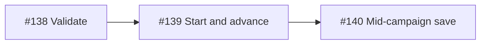

# Campaign in PLAY (#114)

Parent [#114](https://github.com/aawadall/strategos/issues/114). Mechanism (#75) ships; UI does not.

## Sequence

| Child | Role |
|---|---|
| [#138](https://github.com/aawadall/strategos/issues/138) | `CampaignChain.Validate()` — shipped |
| [#139](https://github.com/aawadall/strategos/issues/139) | Session + `StartNext` + `ShowOutcome` → carry-over → next op |
| [#140](https://github.com/aawadall/strategos/issues/140) | Extend save shape for chain + entry; follows #139 |

Do not split #139 (start vs advance share one session). Peel Validate and save so #139 is a shippable vertical slice without persistence redesign.

## Seams

- Begin: `CampaignChainDriver.StartNext`
- Between ops: `CampaignCarryOver.CarryOver` from decided `PlayView.ShowOutcome`
- Single-scenario PLAY remains valid when no chain is active

## Out of scope for #114

Defeat policy beyond rest-hours; strategic map; procedural generator; career/rank (#78, #76, #109).
